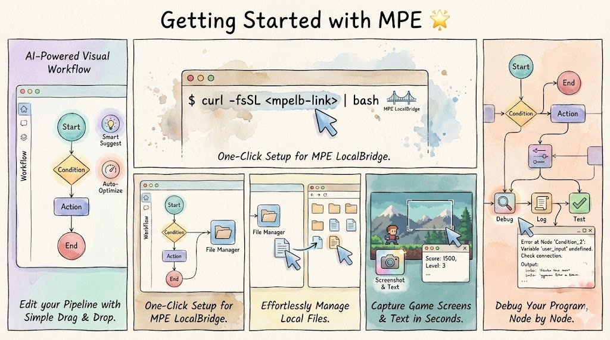
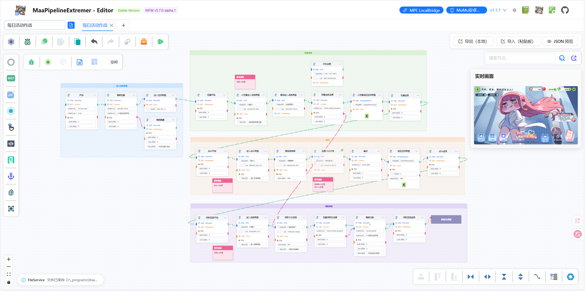
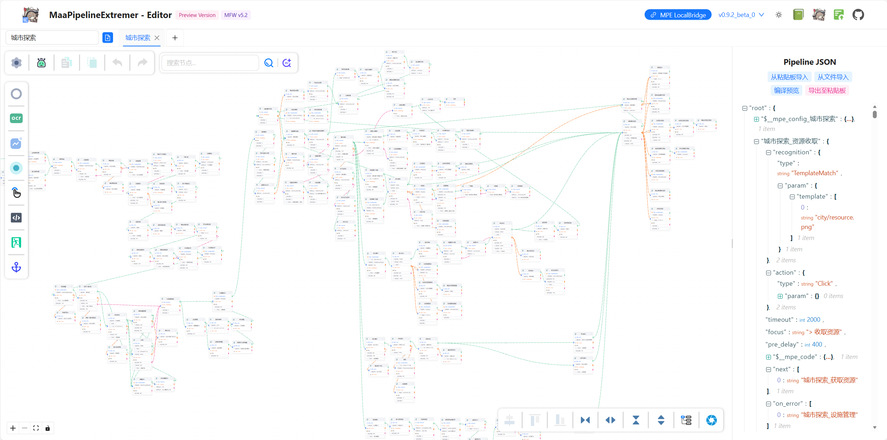
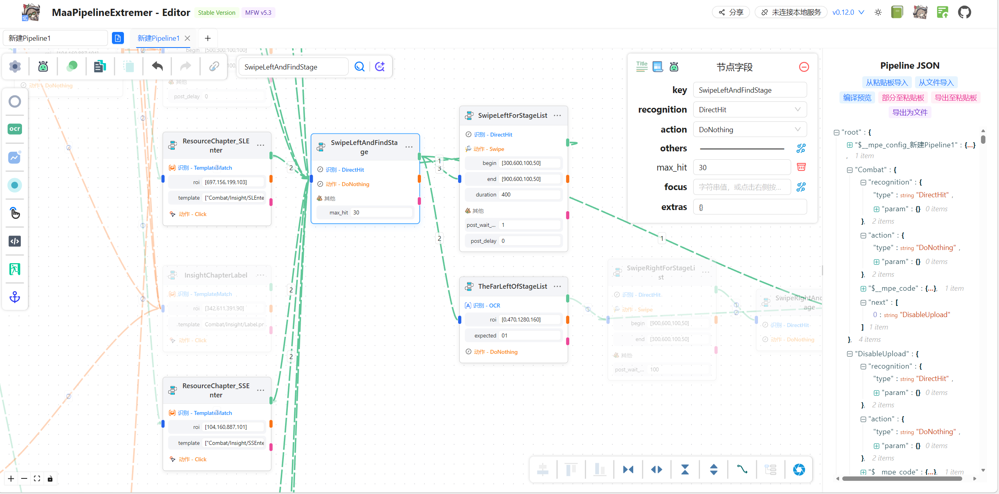

  

# MaaPipelineEditor

_✨ 可视化构建 MaaFramework Pipeline 的下一代工作流编辑器 ✨_ 🛠️ 告别手调千行 JSON！用拖拽+配置的方式，高效构建、调试、分享您的 MFW 自动化流程 🛠️

  
  
  
  
   
  
  
  
  

[🚀 在线使用](https://mpe.codax.site/stable/) | [⭐ 亮点](#亮点) | [📖 文档](https://mpe.codax.site/docs/) | [✨ 展示](#应用场景展示) | [💬 讨论反馈](#讨论与帮助)

## 简介

**MaaPipelineEditor (MPE)** 是一款前后端完全分离架构、运用 [YAMaaPE](https://github.com/kqcoxn/YAMaaPE) 开发经验去芜存菁、由**资源开发者充分实践与微调**的 [MaaFramework](https://github.com/MaaXYZ/MaaFramework) [Pipeline](https://maafw.xyz/docs/3.1-PipelineProtocol.html) 工作流式可视化审阅与编辑工具。

**_“由您设计，由我们支持。”_** 如您所需皆已存在：添加、设计、连接，只需稍作思考，想法之外尽在其中！

## 亮点

#### ✨ 极致轻量，开箱即用

- **无需下载、无需安装**，打开 [在线编辑器 🌐](https://mpe.codax.site/stable) 即可开始可视化 Pipeline 编辑之旅
- 基于 Web 的**真正意义跨平台**、可集成，随时随地 🖥💻 甚至无文件纯文本查看与编辑项目
- 内容全面详尽的 [📖 文档](https://mpe.codax.site/docs/)，所有功能一目了然，任何问题一键查询

#### 🚀 渐进扩展，模块增强

- 通过**一行命令即可增量启用** [本地服务](https://mpe.codax.site/docs/guide/server/deploy.html)，不需要时完全解耦
- 无缝接入**文件管理**、**截图工具**、**流程调试**等本地能力
- 支持自定义框架与 OCR 路径，直接**对齐本地环境**

#### 🧠 所见即所思，流程即逻辑

- 注重**编辑功能**，更注重**阅读体验**！
- **多种节点样式** 🎨 与足够灵活的渲染配置项，依据使用场景随心切换
- 路径类字段全量适配、跨文件逻辑支持，灵活调控你的 Pipeline
- 选中**节点聚焦**、**关键路径高亮**、**可拖拽连接中点**、**便签与分组**，让逻辑跃然纸上 👀
- 布局紧凑、逻辑清晰，让复杂任务一目了然 🧩

#### 🧰 全面辅助，模板自由

- 内置**识别小工具**（文本识别、截图裁剪、取色框选等 🎯），快捷填充字段内容
- 内置**流程化调试**工具，可视运行流，节点式信息呈现
- 搭配丰富**节点预制模板** 📦，并支持创建与保存**自定义模板**，一次配置，处处复用 ♻️
- 图片预览、快捷图片文件选择、实时设备画面，一个面板遍视全图！

#### ⌨️ 类原生交互，高效编辑

- **单面板分类字段添加**，减少上下文切换；字段编辑媲美 IDE 级体验 💡
- 内置多种[语法糖 🍬](https://mpe.codax.site/docs/guide/trait/parser.html#%E8%AF%AD%E6%B3%95%E7%B3%96)，大幅简化类型配置与结构书写

#### 🔄 全面兼容，平滑迁移

- **旧项目一键导入** ✅，自动**识别废弃字段并智能迁移**，提供**自动排版**功能
- 支持节点级 v1 与 v2 **协议混合导入**与任一导出
- 涵盖复合类型等高级结构，提供 [常用命名结构兼容](https://mpe.codax.site/docs/guide/migrate/old.html#%E5%8F%AF%E9%80%89-%E7%89%B9%E6%80%A7%E5%85%BC%E5%AE%B9)
- 支持**配置持久化**，提供集成与分离两种方案

> [!IMPORTANT]
>
> **MPE 专为实际资源开发需求而存在，理念是架构为需求服务，而非虚空造靶或“爱用不用”**。若您在使用过程中有更多的需求或优化建议，欢迎提交 ISSUE，我们真的非常在意开发者的体验！

## 应用场景展示

### 编辑您的 Pipeline

您可以使用 MPE 在文件管理、截图工具、调试工具、AI 补全等各类便捷工具的加持下轻松构造出如下 Pipeline，**即使复杂也能维持清晰的逻辑，兼具易用性与可读性**：

（演示 Pipeline：[MDDL-每日活动作战.json](https://github.com/kqcoxn/MaaDuDuL/blob/v0.1.7/assets/resource/base/pipeline/%E6%97%A5%E5%B8%B8%E4%BB%BB%E5%8A%A1/%E6%AF%8F%E6%97%A5%E6%B4%BB%E5%8A%A8%E4%BD%9C%E6%88%98.json), 522 lines）

（演示 Pipeline：[MNMA-城市探索.json](https://github.com/kqcoxn/MaaNewMoonAccompanying/blob/v3.1.8/assets/resource/base/pipeline/%E6%97%A5%E5%B8%B8%E6%B4%BB%E5%8A%A8/%E5%9F%8E%E5%B8%82%E6%8E%A2%E7%B4%A2.json), 3529 lines）

### 快速理清其他项目的实现逻辑

配合粘贴板导入、自动布局、协议兼容、节点聚焦、关键路径、AI 搜索等功能，您可以**快速了解其他项目的某个功能是如何实现的**，打开网页粘贴即用，无需下载或面对成堆 JSON

（演示 Pipeline：[M9A-combat.json](https://github.com/MAA1999/M9A/blob/v3.17.8/assets/resource/base/pipeline/combat.json), 987 lines）

## 开箱即用

- [文档站](https://mpe.codax.site/docs)
- [稳定版](https://mpe.codax.site/stable)_**（推荐！）**_
- [预览版](https://kqcoxn.github.io/MaaPipelineEditor/)（最新 commit）

> [!IMPORTANT]
> 在每次框架版本迭代时，MPE 的部分特性适配可能存在延迟或遗漏。若您发现相关问题，请提交 ISSUE 或 PR，或在集成开发交流群内指正。

## 讨论与帮助

MPE 项目没有单独的交流群，您可以在 MaaFramework 集成/开发交流 QQ 群（[595990173](https://qm.qq.com/q/gqSv6ukjV8)）询问相关问题或参与讨论。

## 鸣谢

### 开发者

感谢以下开发者对 MaaPipelineEditor 或 YaMaaPE 作出的贡献：

### 特别感谢

社区依赖：

- [MaaFramework](https://github.com/MaaXYZ/MaaFramework)
- [maa-framework-go](https://github.com/MaaXYZ/maa-framework-go)

思路与方案参考：

- [MaaDebugger](https://github.com/MaaXYZ/MaaDebugger)  
  MPE FlowScope 模块参考了该项目中的调试图像标注方案，遵循其协议（MIT）复用部分源码
- [maa-support-extension](https://github.com/neko-para/maa-support-extension)  
  MPE FlowScope 模块参考了该项目的部分调试思路，未使用其源码

## 历史与统计

- `2026.8-NOW`：项目开发与接管（工程化）
- `2026.5-8`：能力扩展与集成形态（全面化）
- `2026.1-4`：节点扩展与交互功能优化（特色化）
- `2025.10-12`：[LocalBridge 协议](https://github.com/kqcoxn/MaaPipelineEditor/issues/23)（本地能力扩展）
- `2025.8-10`：重构，MaaPipelineEditor！（泛用化）
- `2025.5-8`：[MNMA](https://github.com/kqcoxn/MaaNewMoonAccompanying) 实践（思路修补）
- `2025.5`：[YaMaaPE](https://github.com/kqcoxn/YAMaaPE)（项目原型）

